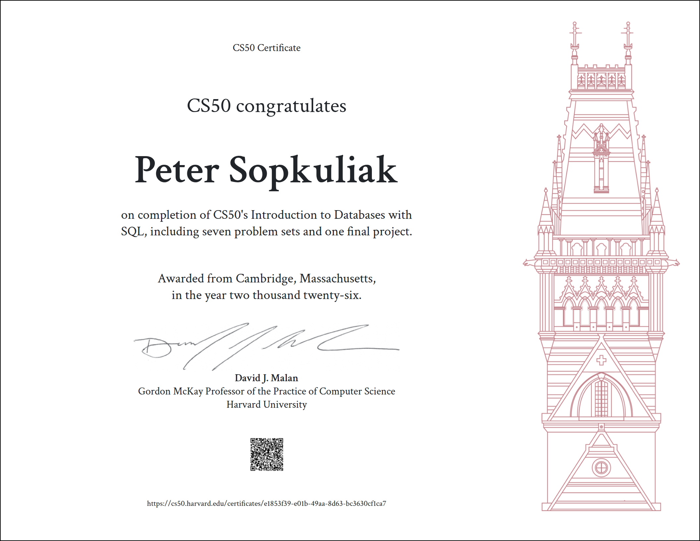
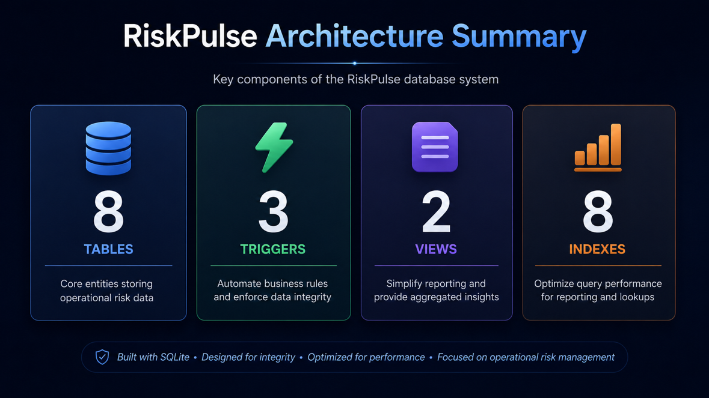
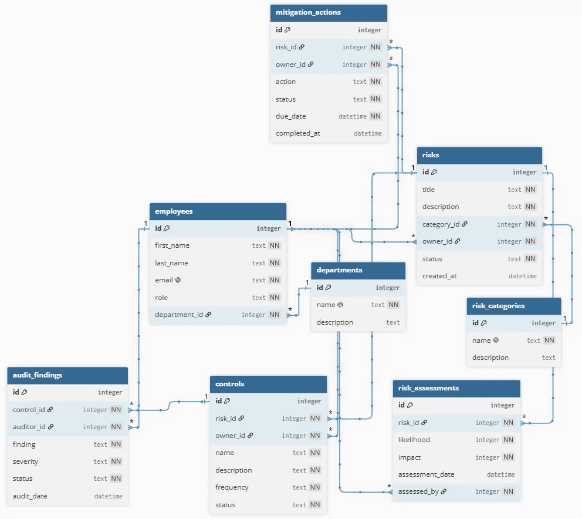
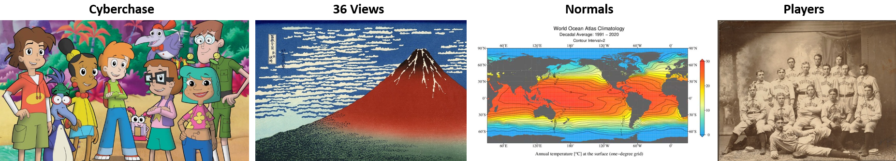
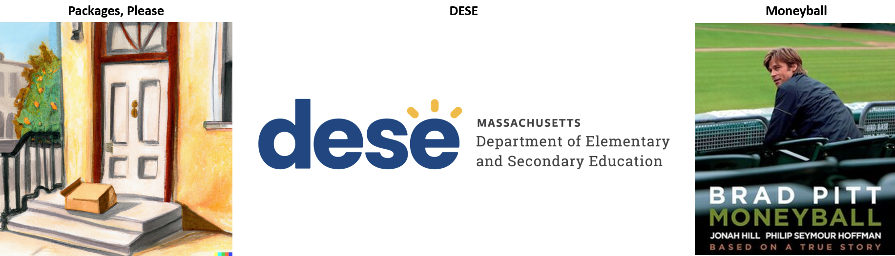
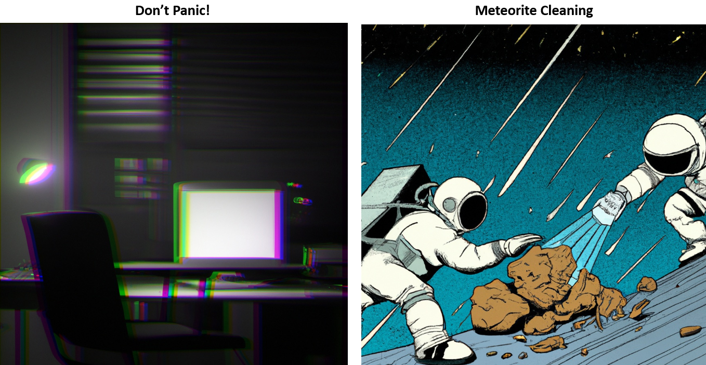
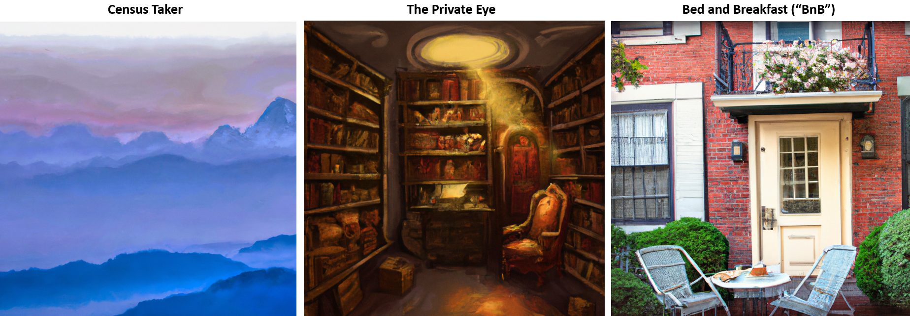

<p align="center">
  
</p>

# CS50 SQL – Introduction to Databases with SQL

Harvard University • David J. Malan & Carter Zenke

Completed by Peter Sopkuliak  |  [🎥 Final Project Video](https://youtu.be/kvqD3iPnS2M)  | [📖 Final Project Documentation](./7-RiskPulse-final-project/DESIGN.md)


This repository documents my successful completion of Harvard University's CS50 SQL course, including all weekly problem sets, practical database exercises, and a fully documented final project called RiskPulse.

## Certificate of Completion




---

# Course Highlights

✅ 8 course modules completed

✅ 20 hands-on database problem set challenges completed

✅ 1 enterprise-inspired final project

✅ Video presentation and technical documentation

✅ Harvard CS50 SQL Certificate awarded


## Featured Final Project – RiskPulse



RiskPulse is an enterprise-inspired Operational Risk Management Database designed and implemented in SQLite as the final project for Harvard's CS50 SQL course.

### Key Features

* End-to-end operational risk management workflow
* Automated business rules using SQL triggers
* Data integrity enforced through constraints and relationships
* Reporting and analytics through SQL views
* Optimized relational design with indexes and normalized schema


---
### Architecture Overview



### Project Resources

🎥 [Watch Final Project Video](https://youtu.be/kvqD3iPnS2M)

📖 [Open Final Project Documentation](./7-RiskPulse-final-project/DESIGN.md)

📂 [Open Final Project Folder](./7-RiskPulse-final-project)

---

## Featured Problem Sets

Throughout the course, SQL concepts were applied to a diverse range of real-world inspired investigations and datasets.

## Course Gallery


### Week 0 – Querying

Introduction to SQL fundamentals including filtering, sorting, aggregation and analysis of structured data. Topics covered: SELECT, WHERE, ORDER BY, LIMIT, LIKE, Aggregate Functions, COUNT, AVG, SUM, DISTINCT. [Open Week 0 Solutions.](./0-querying)



| Problem Set | Domain | Status |
|------------|------------|------------|
| Cyberchase | Cybercrime Investigation | ✅ |
| 36 Views | Art Investigation | ✅ |
| Normals | Database Normalization | ✅ |
| Players | Sports Analytics | ✅ |

### Week 1 – Relating

Understanding how information is connected across multiple tables using relational database principles. Topics covered: Primary Keys,  Foreign Keys, Relationships, JOIN operations,Referential integrity. [Open Week 1 Solutions.](./1-relating)



| Problem Set | Domain | Status |
|------------|------------|------------|
| Packages, Please | Logistics & Tracking | ✅ |
| DESE | Educational Data Analysis | ✅ |
| Moneyball | Sports Analytics | ✅ |

### Week 2 – Designing

Designing relational databases from real-world requirements.
Topics covered: Entity Relationship Diagrams (ERD), Database modeling, Normalization, Schema design. [Open Week 2 Solutions.](./2-designing)


| Problem Set | Domain | Status |
|------------|------------|------------|
| ATL | Airport Operations | ✅ |
| Happy to Connect | Social Networks | ✅ |
| Donuts | Retail Analytics | ✅ |

### Week 3 – Writing

Developing more advanced SQL solutions and complex database logic. Topics covered: Nested queries, Common Table Expressions (CTEs), Subqueries, Data manipulation. [Open Week 3 Solutions.](./3-writing)



| Problem Set | Domain | Status |
|------------|------------|------------|
| Don't Panic! | Data Recovery | ✅ |
| Meteorite Cleaning | Data Cleaning | ✅ |

### Week 4 – Viewing

Creating reusable abstractions for frequently used queries. Topics covered: Views, Query abstraction, Data presentation. [Open Week 4 Solutions.](./4-viewing)



| Problem Set | Domain | Status |
|------------|------------|------------|
| Census Taker | Demographics | ✅ |
| The Private Eye | Investigation & Forensics | ✅ |
| Bed and Breakfast | Hospitality Systems | ✅ |

### Week 5 – Optimizing

Improving database performance and query efficiency. Topics covered: Query planning, Indexes,  Performance optimization, Efficient data access. [Open Week 5 Solutions. ](./5-optimizing)


| Problem Set | Domain | Status |
|------------|------------|------------|
| In a Snap | Social Media Platforms | ✅ |
| your.harvard | University Information Systems | ✅ |

### Week 6 – Scaling

Understanding how databases grow and support larger systems. Topics covered: Scalability concepts, Data growth, Concurrency considerations, Production database challenges. [Open Week 6 Solutions.](./6-scaling)


| Problem Set | Domain | Status |
|------------|------------|------------|
| Happy to Connect (Sentimental, in MySQL) | Social Networks | ✅ |
| From the Deep | Ocean Exploration | ✅ |
| Don't Panic! (Sentimental) with Python | Database Automation & Security | ✅ |


# Repository Structure

```text
CS50SQL
├── 0-querying
├── 1-relating
├── 2-designing
├── 3-writing
├── 4-viewing
├── 5-optimizing
├── 6-scaling
├── 7-RiskPulse-final-project
└── assets
```
